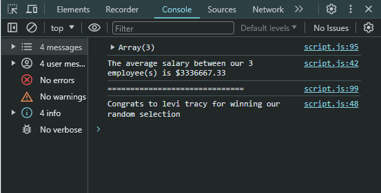

# Challenge3

## Purpose and Description

the purpose of this website is to store and display employee information

This website takes user input from a window promt to store and track employee data. The user inputs employees by first name, last name, and salary. The website stores this data and displays it in a table on the screen. On the other hand in the console the average salary of all the employees and a randome employee is displayed.

## Tech stack

* JavaScript was used to add functionality and lagic to the website

## Design

## Link to finished website
https://adenman.github.io/Challenge3/